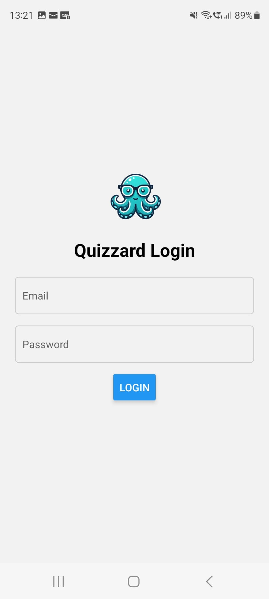
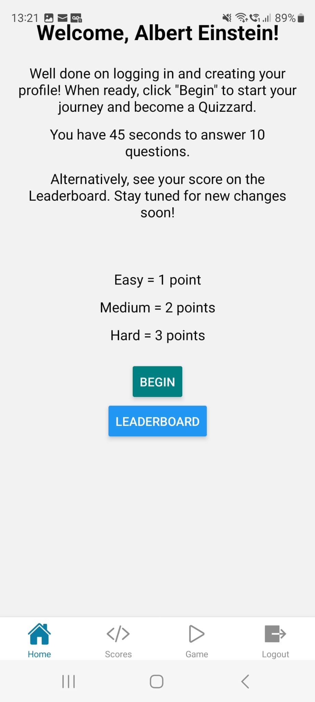
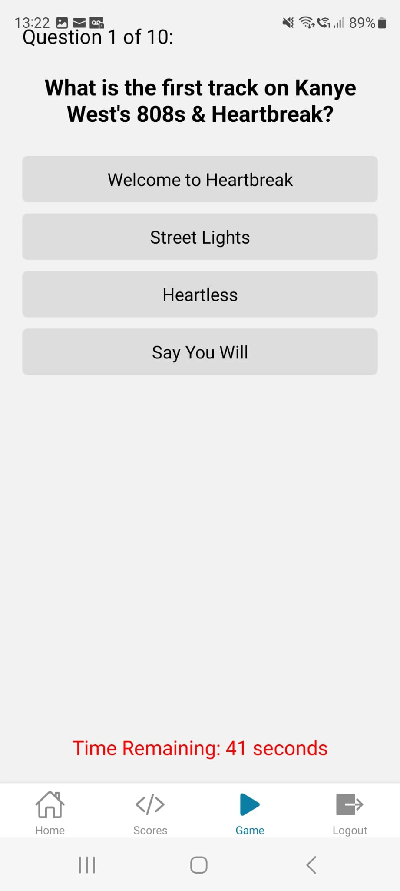
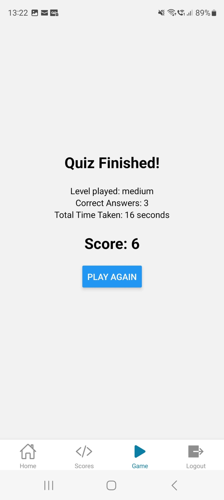

# Quizzard Mobile

This is a mobile version of the Quizzard game based on Open Trivia API (https://github.com/olnov/trivia) written in React Native using the Expo framework. 

    


If you'd like to try your local instance, please look at the installation steps described here - https://github.com/olnov/trivia, and follow the steps in this README.

## Get started 

1. Install dependencies

   ```bash
   npm install
   ```
2. Add your backend url to the .env file. Example:
   ```yaml
   EXPO_PUBLIC_BACKEND_URL='http://192.168.1.10:8080'
   ```  
3. Start the app

   ```bash
    npx expo start
   ```
